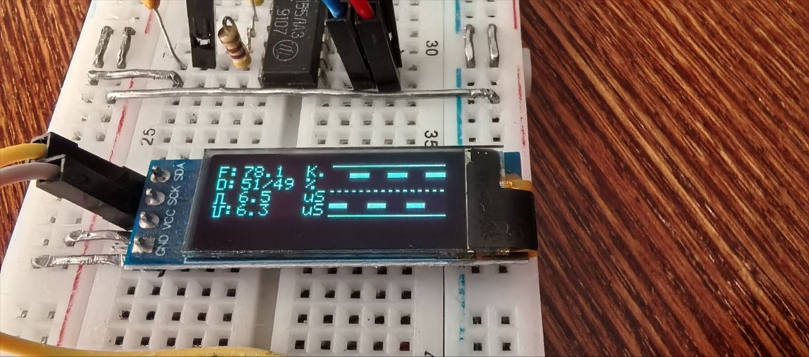

# NanoLogic

Мой первый проект для Arduino Nano - попытка сделать простой логический пробник с функцией логического анализатора и осциллографа

## Детали

- Arduino Nano (Atmega 328p)
- Oled Дисплей 1306 128х32 или 128х64
- Две тактовые кнопки

## Подключение

Дисплей:

- Arduino Nano GND -> Display GND
- Arduino Nano +5V -> Display VDD
- Arduino Nano A4 -> Display SDA
- Arduino Nano A4 -> Display SCK

Кнопка-:

- Arduino Nano GND -> Кнопка1 контакт 1
- Arduino Nano D4  -> Кнопка1 контакт 2

Кнопка+:

- Arduino Nano GND -> Кнопка1 контакт 1
- Arduino Nano D5  -> Кнопка1 контакт 2

Входы:

- Arduino Nano D2 - Вход частотомера (вход считывает задний и предний фронт сигнала )

## Умеет

Отображать

- Частоту
- Скважность
- Длительность положительного полупериода
- Длительность отрицательного полупериода
- Форму сигнала основанной на данных измерений скважности
- Изменять количество отображаемых периодов в пределах отт 1 до 8 по нажатию кнопок + и -
